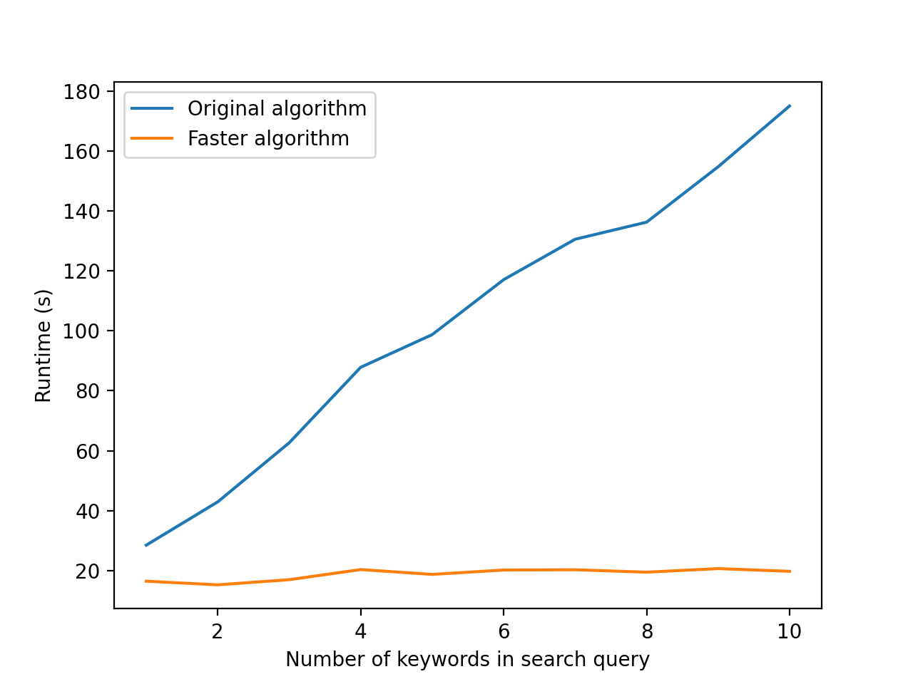

# Week 3

I discovered a significant bottleneck in an old FORWARD Data Lab project that ranked researchers by query keywords. This bottleneck can be found in `guidelines/keyword_assignment/rank_researchers.py`. In this file, a series of SQL `JOINS` (inner join) in the function `compute_author_keyword_ranks` were found to significantly slow down the algorithm. Converting these joins to `LEFT JOINS` made the algorithm faster, without causing any noticable difference in the output of the algorithm. The figure below shows the effect of this update with respect to the size of the keyword query. The Original Algorithm uses `JOINS` and the Faster Algorithm uses `LEFT JOINS`.

